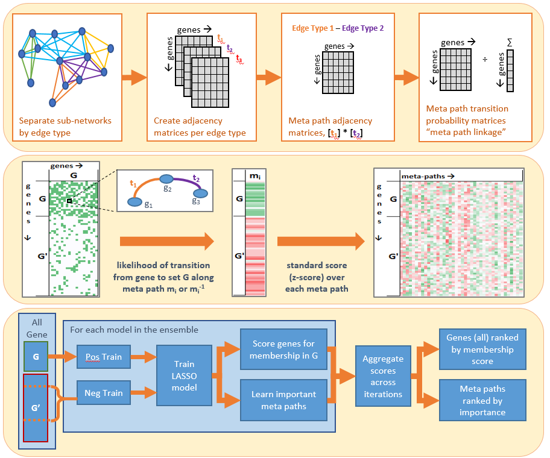

# GeneSet MAPR - Gene Set Analysis using Heterogeneous Network Patterns

'Gene Set **M**eta path **A**nalysis for **P**attern **R**egression', **MAPR**, is a tools that addresses the bioinformatics task to identify the genes most related to a given gene set using heterogeneous networks of gene-gene relationships. It relies on a supervised learning algorithm that for the first time explicitly considers the patterns of direct as well as indirect relationships present in the network to quantify gene-gene similarities. More information about the method and its evaluations can be found at the manuscript at [bioRxiv](https://www.biorxiv.org/content/10.1101/629816v1) :

```
Gene Sets Analysis using Network Patterns.
Gregory Linkowski, Charles Blatti, Krishna Kalari, Saurabh Sinha, Shobha Vasudevan
bioRxiv 629816; doi: https://doi.org/10.1101/629816
```

Questions or feedback should be directed to Charles Blatti ([blatti@illinois.edu](mailto:blatti@illinois.edu)).

## Table of Contents

1. [Overview](#overview)
2. [Prerequisites](#prerequisites)
3. [QuickStart Tutorial](#quickstart-tutorial)
    1. [Preparing the Heterogeneous Network](#preparing-the-heterogeneous-network)
    2. [Creating Meta-Path Features](#creating-meta-path-features)
    3. [Learning Ensemble to Rank Genes](#learning-ensemble-to-rank-genes)
4. [MAPR Resources](#mapr-resources)
    1. [Input File Formats](#input-file-formats)
    2. [MAPR File Formats](#mapr-file-formats)
5. [EMT Analysis Data Set](#emt-analysis-data-set)
6. [Acknowledgements](#acknowledgements)

## Overview

Through its multi-step process, the MAPR tool takes in a description of a heterogeneous network of gene-gene relations and one (or more) input gene sets, and returns a ranking of all genes in the network by their meta-path based similarity to the input set. The three primary steps of the algorithm are as follows:

1. **Prepare the Heterogeneous Network**: given an `edge_file` containing raw network edges, quantify meta paths through heterogeneous network
2. **Create Meta-Path Features**: given `input_sets` of gene sets, use cross-validation and convert meta-paths into gene-based features for future learning
3. **Learning Ensemble to Rank Genes**: From meta path features, train an ensemble of LASSO-based classifiers to rank genes for membership to input set.

The major parameters of the method are the types of meta-paths that are to be considered (`keep_types`), the lengths of those meta paths (`max_metapath_length`), the number of folds in cross-validation (`cv_folds`), and the number of classifiers in the ensemble predictor (`num_models`).

Below is a diagram from the paper that shows a schematic for each of the three primary steps:



## Prerequisites

The final version of GeneSet MAPR was written and tested in n 3.5. Certain functionality is known to not work with version 2.7 and earlier.

The only non-standard python packages that are required are [NumPy](https://numpy.org/) and [scikit-Learn](https://scikit-learn.org/stable/). Exact package numbers are listed in the `requirements.txt` file.

## QuickStart Tutorial

In this section, we will walk through a quick example with demo data. In this example we will use a heterogeneous network with many edge types. We will calculate all meth-paths of length 1, 2, and 3. We will then convert these meth-path statistics into gene features for two different input gene sets. Finally, we will use those features to train an ensemble of classifiers to return a ranked list of related genes for each of our input sets.

### Preparing the Heterogeneous Network

The first step of network processing is handled by the script: `MAPR_networkPrep.py`.

This script requires the `network_prefix`, the path (relative or fixed) to the two network files provided by the user, 1) the `.edge.txt` file that contains the edges of the heterogeneous network and 2) the `.keep.txt` file that describes the different network node and edge types. Information about these file formats are found in the MAPR Resources [input formats](#input-file-formats) section.

The `MAPR_networkPrep.py` script will create the meta-path matrices and other supporting files, such as lists of all unique genes or non-gene terms in the network. By default this will be created in the same directory as the network location, but can be changed with an optional flag, `-n`.

Optional arguments are specified with flags, and include:

- `-k` An alternative keep file location. Otherwise assumed to be in same directory as the edge file, named with the same name (ie: `network_prefix`.keep.txt).
- `-l` The maximum length of meta-paths to calculate. Currently, the script will calculate paths up to lengths of 3 edges, but this can be set to 2 or 1.
- `-n` An alternative output location for the processed network. By default the processed network is saved in the same directory as the provided edge file.
- `-t` Whether to save each single-edge sub-network. Default value is False. If set to True, then an edge file will be saved for each individual edge type in the original network file.
- `-v` How much feedback to receive at the command line. Default value is 0, but can be set to 1 or 2.

An example command below explicitly specifies the location of the `.keep.txt` file, a different output location, limiting meta-paths to lengths of no greater than 3 edges, saving .txt sub-network edge lists, and specifying verbose terminal output:

``` bash
python3 MAPR_networkPrep.py ./demo_data/networks/demo_net.edge.txt \
    -k ./demo_data/networks/demo_net.keep.txt -n demo_outputs/networks/ -l 3 -t TRUE -v 1
```

The warnings in this demo indicate meta-paths that fail to connect any nodes. This may happen when very sparse sub-networks are combined, and no nodes use edges from both edge types. Such meta-paths won't influence the final prediction.

More information about the output network and MetaPath files and formats can be found in the MAPR Resources [file formats](#mapr_networkprep-outputs).

### Creating Meta-Path Features

The second step of building meta-path related features for input gene sets are calculated by: `MAPR_buildFeatures.py`.

The script requires 1 argument specifying the name of the network to use. It also will use a directory that contains the input gene set samples. By default, it assumes the processed network is stored in './networks/', the gene sets to be processed are in './gene_sets/', and the resulting output will be saved in './output', but these defaults can be overridden with optional flags.

The script will calculate meta-path connections for all gene sets in the samples directory for multiple cross-validation folds of the data. Information about the format and naming of the gene set files within the set directory are found in the MAPR Resources [input formats](#gene-set-files) section.

Optional arguments are specified with flags, and include:

- `-n` Directory where the processed network is stored. Default is './network'
- `-s` Directory where one or more gene set text files are stored. Default is './samples'
- `-o` Directory where the output will be saved. Default is './output'
- `-f` The number of folds to use in cross-validation. Default value is 4.
- `-v` How much feedback to receive at the command line. Default value is 0, but can be set to 1 or 2.

To continue our demo example (while specifying a network saved to an alternative location, the gene set input directory, 4 folds for cross-validation, an alternative output folder, and verbose terminal feedback), we can use the following command:

``` bash
python3 MAPR_buildFeatures.py demo_net -n demo_outputs/networks/ \
    -s demo_data/gene_sets/ -o demo_outputs/features/ -f 4 -v 1
```

More information about the output batch of feature files and formats in the printed to the `batch_directory` can be found in the MAPR Resources [file formats](#mapr_buildfeatures-outputs).

### Learning Ensemble to Rank Genes

The final step of the learning an ensemble of classifiers for predicting and ranking genes for membership in the input sample gene sets is performed by `MAPR_characterizeSet.py`

The script requires the `batch_directory`, an argument specifying the location of the meta-path features across the sample partitions that is the output by the MAPR_buildFeatures.py script. The `MAPR_characterizeSet.py` script builds multiple models for the processed gene sets to learn how the genes are interconnected and creates a ranked list of all genes by patterns of connectedness. This is done both for the full gene set and each of several fold partitions. The Area Under the Receiver Operating Characteristic Curve (AUC) is reported for each fold to report how well the learned models predict the original gene set -- or how well they fit the data.

Optional arguments for the `MAPR_characterizeSet.py` script are specified with flags, and include:

- `-m` Number of models to create, affects stability of results. Default is 101.
- `-l` Maximum meta-path length to consider. Default is 3.
- `-i` Path and filename of a text file containing edge types to omit from consideration. Default is 'NONE'.
- `-v` How much feedback to receive at the command line. Default value is 0, but can be set to 1 or 2.

An example of this script specifying a maximum considered meta-path length of 3, the creation of only 31 models per set, and verbose terminal feedback is below.

``` bash
python3 MAPR_characterizeSet.py ./demo_outputs/features/batch-000/ -m 31 -l 3 -v 1
```

The final outputs of this MAPR tool are the ranked gene lists and the AUC performance files for each partition.  More information about the files and their formats can be found in the MAPR Resources [file formats](#mapr_characterizeset-outputs).

## MAPR Resources

The following sections have additional detail about the file formats produced and consumed by the MAPR scripts.

### Input File Formats

Before running MAPR, users will need to prepare the following files:

#### Network Edge File

The network edge file specifies edges in the network and an example can be found at `./demo_data/networks/demo_net.edge.txt`. Each line has four columns specifying an origin node, a terminal node, a weight, and an edge type. In the example below, three edge types are shown: GO_MolFunc, pfam_domain, and String_coexpression. Gene names begin with "ENSG", while gene ontology terms begin with "GO_" and protein families with "pfam_".

```
ENSG00000004779	ENSG00000006715	681	STRING_coexpression
ENSG00000004779	ENSG00000005249	537	STRING_coexpression
ENSG00000004779	ENSG00000007923	681	STRING_coexpression
ENSG00000004779	ENSG00000008018	647	STRING_coexpression
GO_0001085	ENSG00000005339	2	GO_MolFunc
GO_0001085	ENSG00000004487	1	GO_MolFunc
GO_0001102	ENSG00000005339	2	GO_MolFunc
Pdom_Ank	ENSG00000001629	7.39	pfam_domain
Pdom_Ank	ENSG00000001631	7.25	pfam_domain
Pdom_SH3_1	ENSG00000007264	5.33	pfam_domain
Pdom_SH3_1	ENSG00000008735	4.85	pfam_domain
Pdom_SH3_2	ENSG00000000938	6.73	pfam_domain
Pdom_SH3_2	ENSG00000002834	5.25	pfam_domain
```

The STRING_coexpression edges are direct gene to gene edges. As such, the first two columns contain gene names. Both GO_MolFunc and pfam_domain edge types group genes into shared terms. For those, the first column contains the term (eg. Pdom_Ank) while the second column is one of the genes in that term. The third column scores the strength of that particular edge, or connection. Note that the way scores are calculated and defined may vary greatly from one edge type to another. MAPR will normalize the scores for each edge type to allow more equivalent comparison of weights across types.

#### Edge Type Keep File

The keep file tells MAPR how to distinguish between gene and term nodes, as well as indicate which edges to keep or discard when processing the network. An example can be found at `./demo_data/networks/demo_net.keep.txt`. The keep file consists of three sections, indicated by the required headers "GENE TYPES", "EDGE TYPES", and "CUTOFF RANGE". Here is an example keep file excerpt with the three sections and the columns within each section shown:

```
GENE TYPES
human1	ENSG	keep
human2	LRG_	no

EDGE TYPES
GO_MolFunc	indirect	keep
kegg_pathway	indirect	no
pfam_domain	indirect	keep
STRING_coexpression	direct	no

CUTOFF RANGE
GO_MolFunc	10	3000
kegg_pathway	10	3000
pfam_domain	10	3000
```

Under "GENE TYPES" are three columns indicating species, the pattern of characters occurring at the start of each gene of that type (for use by regex), and the indicator whether to keep or discard the genes in that row. Setting the indicator column to "keep" or "yes" will keep genes of that type, while "no" will discard them.

Note that genes must start with some identifying set of characters. In the provided example network, all genes used either the Ensemble Gene ID or the Locus Reference Genomic identifier. Therefore, every gene name began with either "ENSG" or "LRG". If you use gene names with much wider variation, you may wish to use a prefix such as "gname_" to distinguish genes from non-gene terms.

The EDGE TYPES section has three columns: the name of the edge type, whether it is "direct" (gene-to-gene connection) or "indirect" (genes belong to a shared term), and an indicator whether to keep that edge type (ie: "keep" or "yes").

The CUTOFF RANGE section is specific to indirect edge types. The three columns there are: edge type, minimum considered term size, and maximum considered term size. For instance, the file example_alternate.keep.txt has the row "GO_MolFunc    10    3000", indicating that all terms containing less than 10 genes or more than 3000 will be ignored. One may wish to do this to filter out terms that are considered either too noisy and subjective, or too broad to be useful.

By default, the MAPR scripts will look for a keep file with the same name as the edge file. For example, if the provided edge file is named "network_name.edge.txt", the script will look for "network_name.keep.txt". This can be changed using the '-k' command-line argument.

#### Gene Set Files

Gene sets should be provided as text files (examples shown in ./demo_data/gene_sets/). They may be given as one or two files. In the case that up- and down-regulated genes are provided as two separate files to be treated as one gene set, the files should begin with the same name and end with either '_DN.txt' or '_UP.txt'.

Genes need not be sorted. The script will remove any redundant entries, and ignore genes that don't appear in the network.

An example of the first several lines in a sample gene set:

```
ENSG00000007047
ENSG00000008294
ENSG00000002919
ENSG00000005206
ENSG00000002726
ENSG00000006534
ENSG00000006712
...
```

### MAPR File Formats

#### MAPR_networkPrep Outputs

There are many outputs that will be produced when `MAPR_networkPrep.py` is run. These will be stored in the location of the input network unless the `-n` flag is used.

1. Processed Network Files will appear together in the output directory that is the `network_name`
   1. **edges.txt** - complete list of valid edge types in the processed network
   2. **genes.txt** - complete list of valid gene names in the processed network
   3. **indices.txt** - map from gene name to processed edge index in "network.txt" output
   4. **keep.txt** - processed ".keep.txt"-format input file
   5. **network.txt** - processed ".edge.txt"-format input file
   6. **node-degree.txt** - gene by edge type matrix with each entry being the node degree at that gene node for edges of that type
   7. For each `edge_type`
      1. **[network_name]-[edge_type].txt** - list of processed network edges with weights for the specified `edge_type`
2. MetaPath Files will appear together in the output directory that is named `[network_name]_MetaPaths`
   1. **key.txt** - mapping between id for each meta path type, `meta_path_index`, and the human-readable description of the meta path
   2. **key_primaries.txt** - mapping of ids for all the meta paths of length 1
   3. **key_termNonGene.txt** - mapping of ids for all the meta paths of length 1 that were collapsed to direct gene-gene edges from indirect property-gene edges
   4. For each `meta_path_index` that is an identifier for a meta path type
      1. **[meta_path_index].gz** - zipped matrix where the rows and columns are ordered by **genes.txt** and the values are the score for the meta_path_index type of the file
      2. **[meta_path_index]tl.txt** - list of all property labels for the indirect property-gene edge type
      3. **[meta_path_index]tm.gz** - the transpose of **[meta_path_index].gz**, used for indirect property-gene edge types

#### MAPR_buildFeatures Outputs

There are many outputs that will be produced when `MAPR_buildFeatures.py` is run. These will be stored in the `./outputs/` unless the `-o` flag is used.

For each run of MAPR_buildFeatures.py (i.e. `batch-000`), a set of directories will be generated for each sample. This directories will either correspond to the `full` gene set of that sample or a subsampled `part` of that sample's genes. In the case of 4-fold cross validation, there will be `part-` subdirectories ending in `00`, `01`, `02`, and `03`. For this script, the outputs are:

1. **parameters.txt** - a two column file that records the parameter and their values for this run
2. For each `[sample]`'s input gene set and each `full-[sample]` or `part-[sample]-[XX]` partition:
   1. **known.txt** - list of genes from that sample's input gene set that the algorithm is given for training. This will be the entire matched gene list for `full` partitions.
   2. **concealed.txt** - list of genes from that sample's input gene list that the algorithm does not see in training. This will be 1/n of the matched gene list for `part` partitions with n-fold cross-validation
   3. **ignored.txt** - list of genes from that sample's input gene set that did not match any genes in the network
   4. **features_ZscoreSim.gz** - a zipped genes by meta path type matrix where the row order matches **genes.txt**, the column order matches the meta path type index (**key.txt**), and the values reflect the transformed feature score for that gene for that meta path type

#### MAPR_characterizeSet Outputs

There are many outputs that will be produced when `MAPR_characterizeSet.py` is run for a particular model configuration, `model_description`. These will be stored in the `batch_directory` alongside the outputs of the previous steps. For the `MAPR_characterizeSet.py` script, the outputs are:

1. **classifier-[model_description].txt** - a description of the model and model parameters values
2. **results-AUC_mean_by_set.txt** - for each `model_description`, the average AUC for each input gene set sample across the partition folds
3. **results-AUC_every_fold.txt** - for each cross validation partition and each model description, the AUC for the ranked list of left out genes on that input gene set partition.
4. For each `[sample]`'s input gene set and each `full-[sample]` or `part-[sample]-[XX]` partition:
   1. **parameters-[model_description].txt** - a description of the given model and model parameters values for the ensemble learned on that given partition
   2. **ranked_all_genes-[model_description]_Avg.txt** - rows for every gene in the network with columns for 1) weighted combination across models of z-scores of the predictions, 2) the gene name, 3 and 4) the gene rank for relatedness to input gene set
   3. **ranked_genes-[model_description]_Avg.txt** - rows for every gene in the network not in **known.txt** with columns for 1) weighted combination models of prediction scores normalized between 0 and 1, 2) the gene name, 3) the gene rank for relatedness to input gene set, and 4) the weighted combination of model prediction ranks
   4. **scored_features-[model_description].txt** - a meta-path-type by ensemble-model matrix with the [-1,1] normalized meta path type weights for each model.  The first three columns show 1) the average meta path type weight across models, 2) the length of the meta path type, and 3) the name of the meta path type. The first row lists the combination weights for each model.

## EMT Analysis Data Set

In the final case study of the MAPR paper, we examine the genes associated with epithelial-to-mesenchymal transition (EMT). The network and sample gene sets associated with this analysis are available to download as a zipped archive from [here](http://veda.cs.uiuc.edu/MAPR/emt_analysis.zip).

## Acknowledgements

This work was supported by the National Institutes of Health [grant 1U54GM114838 awarded by NIGMS] through funds provided by the trans-NIH Big Data to Knowledge (BD2K) [initiative](https://commonfund.nih.gov/bd2k).
